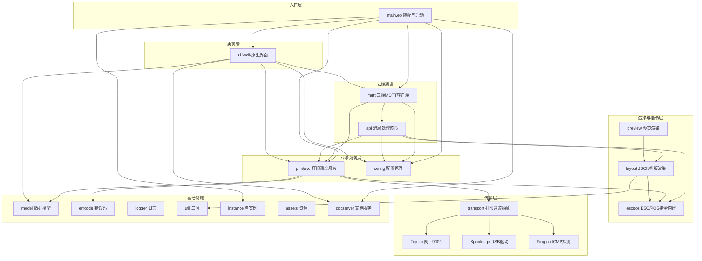
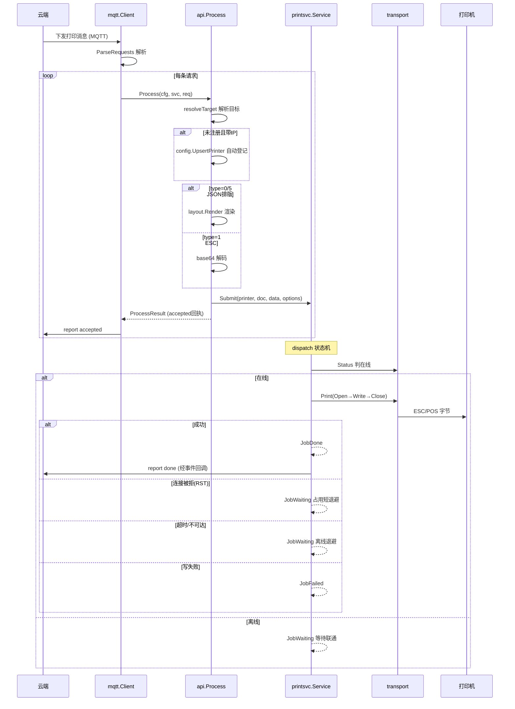
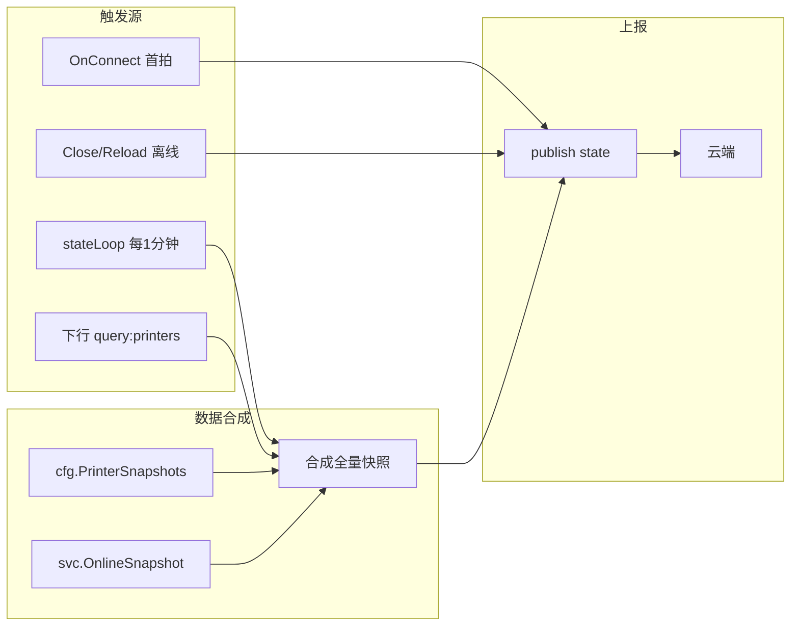
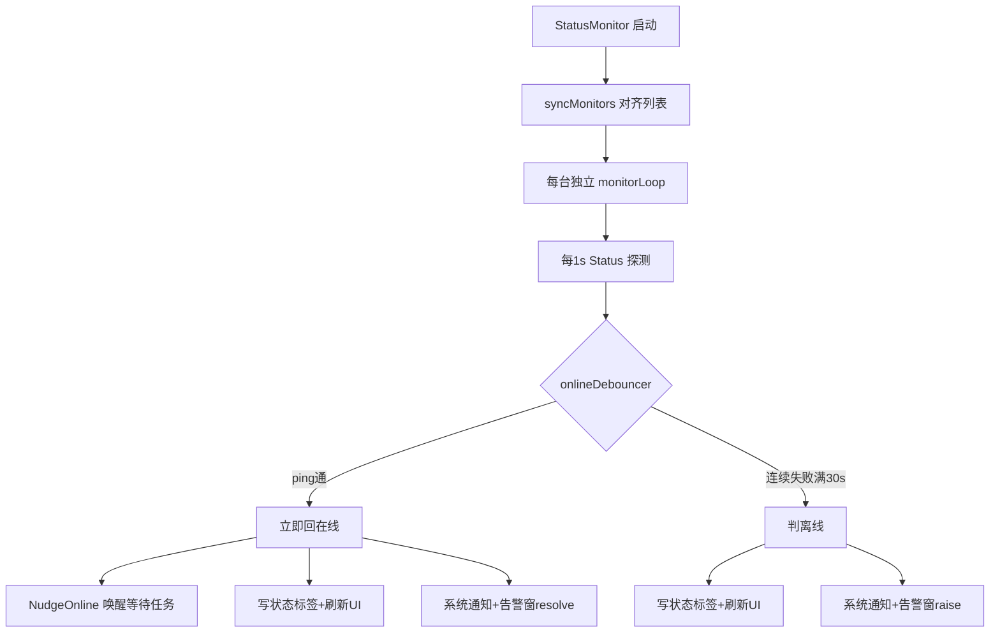

# 聪明付票据打印服务器 — 架构分析报告

> 分析对象：[`congmingpay`](main.go:1) 项目（面向餐厅厨房的热敏小票打印服务器，Windows 端）
> 分析依据：[`README.md`](README.md:1)、[`功能说明.md`](功能说明.md:1)、[`CLAUDE.md`](CLAUDE.md:1)、[`main.go`](main.go:1)、[`go.mod`](go.mod:1) 及各模块源码

---

## 一、项目定位

- **目标场景**：餐厅厨房热敏小票打印，云端下发指令 → 本地服务执行 → USB/网口输出到打印机。
- **最终形态**：单个静态可执行文件（`congmingpay.exe`），目标机零运行时依赖，兼容 Windows 7 SP1 至最新版本。
- **技术栈**：Go 1.20.14（锁版本以支持 Win7）、Walk（原生 Win32 GUI）、MQTT 3.1.1（paho）、ESC/POS 指令、SQLite（modernc 纯 Go 无 CGO）。
- **构建架构**：`GOARCH=386`（32 位通吃 Win7/10/11 的 32&64 位）。

---

## 二、分层架构总览

项目采用清晰的分层架构，为多品牌、多通道、云端集成铺路。品牌差异全部收敛在传输层与指令层之下。

---

## 三、各模块职责详解

### 3.1 入口层

| 模块 | 文件 | 职责 |
|------|------|------|
| [`main`](main.go:29) | [`main.go`](main.go:1) | 程序入口，负责装配与生命周期管理：日志初始化 → 单实例守卫 → 配置加载（损坏则备份+默认启动）→ 打印服务初始化与任务恢复 → MQTT 客户端创建 → 文档服务启动 → UI 创建与任务事件回调装配 → 运行 |

**main.go 装配顺序**（关键依赖链）：
1. `logger.Init` — 日志先行
2. `instance.Acquire` — 单实例守卫（命名互斥体，跨用户会话）
3. `config.Load` — 配置加载（损坏备份+默认回退）
4. `printsvc.OpenStoreOrRecover` + `NewWithStore` + `RestoreAndResume` — 打印服务与任务恢复
5. `mqtt.New` — 云端通道
6. `docserver.New` — 文档服务
7. `ui.NewApp` — 界面构造
8. `svc.SetOnJobEvent` — 任务事件回调并联（系统通知 + MQTT 上报）
9. `mc.Start` / `ds.Start` / `app.Run` — 启动各服务

### 3.2 云端通道层

| 模块 | 核心文件 | 职责 |
|------|----------|------|
| [`mqtt`](internal/mqtt/Client.go:1) | [`Client.go`](internal/mqtt/Client.go:1)、[`Report.go`](internal/mqtt/Report.go:1)、[`Resolve.go`](internal/mqtt/Resolve.go:1)、[`Iot.go`](internal/mqtt/Iot.go:1) | 云端唯一通道。MQTT 3.1.1 客户端，支持自建/云消息队列/物联网平台三选一。订阅下行主题收打印/查询消息，向上报主题发 report（回执）与 state（状态快照，定时+查询+LWT 离线） |
| [`api`](internal/api/Print.go:1) | [`Print.go`](internal/api/Print.go:1) | 消息处理核心（无 HTTP）。`Process` 处理打印请求：目标解析 → 自动登记未注册打印机 → 渲染/解码 → 提交打印服务。供 MQTT 与 UI「JSON测试」复用 |

**mqtt 模块依赖**：`api`、`config`、`errcode`、`logger`、`model`、`printsvc`
**api 模块依赖**：`config`、`errcode`、`layout`、`model`、`printsvc`

### 3.3 业务服务层

| 模块 | 核心文件 | 职责 |
|------|----------|------|
| [`printsvc`](internal/printsvc/Service.go:1) | [`Service.go`](internal/printsvc/Service.go:1)、[`Store.go`](internal/printsvc/Store.go:1)、[`Persist.go`](internal/printsvc/Persist.go:1)、[`Events.go`](internal/printsvc/Events.go:1)、[`Status.go`](internal/printsvc/Status.go:1) | 并发打印调度器。每任务独立 goroutine，每台打印机串行锁。dispatch 状态机：判在线 → 真打裁决 → 两档退避（占用短退避/离线退避）。任务持久化到 `jobs.db`（SQLite），重启恢复续打 |
| [`config`](internal/config/Config.go:1) | [`Config.go`](internal/config/Config.go:1) | 配置管理。本地 JSON（`config.json`），含 Settings + Printers 注册表。打印机 ID 用时间戳+原子序号保证唯一。损坏文件备份后默认启动 |

**printsvc 模块依赖**：`errcode`、`escpos`、`logger`、`model`、`transport`
**config 模块依赖**：`model`

### 3.4 渲染与指令层

| 模块 | 核心文件 | 职责 |
|------|----------|------|
| [`layout`](internal/layout/Render.go:1) | [`Render.go`](internal/layout/Render.go:1)、[`Element.go`](internal/layout/Element.go:1)、[`Text.go`](internal/layout/Text.go:1)、[`Table.go`](internal/layout/Table.go:1)、[`Graphics.go`](internal/layout/Graphics.go:1) | JSON 排版渲染。把云端 type=0 的 JSON 小票排版数组渲染为 ESC/POS 字节。严格模式：字段非法整单拒绝 |
| [`escpos`](internal/escpos/Command.go:1) | [`Command.go`](internal/escpos/Command.go:1)、[`Layout.go`](internal/escpos/Layout.go:1)、[`QRCode.go`](internal/escpos/QRCode.go:1)、[`Barcode.go`](internal/escpos/Barcode.go:1)、[`Raster.go`](internal/escpos/Raster.go:1) 等 | ESC/POS 指令构建。链式 Builder，支持文字/条码/二维码/图片/蜂鸣/切纸等。中文经 GB18030 编码。纸宽自适应（58mm=32字符/80mm=48字符） |
| [`preview`](internal/preview/Preview.go:1) | [`Preview.go`](internal/preview/Preview.go:1)、[`Canvas.go`](internal/preview/Canvas.go:1)、[`Elements.go`](internal/preview/Elements.go:1) | 预览渲染。把 JSON 排版任务按纸宽渲染成卷纸图（近似效果），供 UI 打印队列预览 |

**layout 模块依赖**：`escpos`、`util`
**preview 模块依赖**：`layout`（间接）

### 3.5 传输层

| 模块 | 核心文件 | 职责 |
|------|----------|------|
| [`transport`](internal/transport/Printer.go:1) | [`Printer.go`](internal/transport/Printer.go:1) | 打印通道抽象。定义 `Printer{Open/Write/Close}` 接口与 `ConnError`（区分 Refused/超时）|
| - | [`Tcp.go`](internal/transport/Tcp.go:1) | 网口打印。`net.DialTimeout("tcp", ip+":9100")` 直发。拨号失败分两类：RST（被占/未就绪）vs 超时/不可达 |
| - | [`Spooler.go`](internal/transport/Spooler.go:1) | USB 打印。经 Windows winspool 发原始 ESC/POS 字节（`//go:build windows`）|
| - | [`Ping.go`](internal/transport/Ping.go:1) | ICMP 在线探测。Windows `IcmpSendEcho`（普通权限，不碰 9100），精确译码失败原因 |
| - | [`Status.go`](internal/transport/Status.go:1) / [`SpoolerStatus.go`](internal/transport/SpoolerStatus.go:1) | 状态查询。网口 ICMP / USB winspool `GetPrinter` |

**transport 模块依赖**：`model`（Printer 类型）、`logger`、外部库 `alexbrainman/printer`、`golang.org/x/sys/windows`

### 3.6 基础设施层

| 模块 | 文件 | 职责 |
|------|------|------|
| [`model`](internal/model/Printer.go:1) | [`Printer.go`](internal/model/Printer.go:1)、[`Job.go`](internal/model/Job.go:1)、[`Settings.go`](internal/model/Settings.go:1) | 数据模型。Printer（含品牌/规格/连接/来源/参数）、Job（任务+状态）、Settings（服务名/通知/兼容/MQTT/文档服务）|
| [`errcode`](internal/errcode/Errors.go:1) | [`Errors.go`](internal/errcode/Errors.go:1) | 错误码定义。全局错误码（1xxx-5xxx），`CodeOf(err)` 提取码 |
| [`logger`](internal/logger/Logger.go:1) | [`Logger.go`](internal/logger/Logger.go:1) | 全局文件日志（`congmingpay.log`）。业务代码一律调用 logger，不直接用标准库 log |
| [`util`](internal/util/Encoding.go:1) | [`Encoding.go`](internal/util/Encoding.go:1) | 通用工具。`ToGB18030` 编码（x/text）|
| [`instance`](internal/instance/SingleInstance.go:1) | [`SingleInstance.go`](internal/instance/SingleInstance.go:1) | 单实例控制。命名互斥体 `Global\congmingpay-print-server`，跨用户会话唯一 |
| [`assets`](internal/assets/Assets.go:1) | [`Assets.go`](internal/assets/Assets.go:1) | 资源嵌入。`//go:embed app.png` 图标，保证单 exe |
| [`docserver`](internal/docserver/Server.go:1) | [`Server.go`](internal/docserver/Server.go:1) | 接口文档服务。仅局域网、只读，`GET /` 返回内嵌 HTML 文档页，无任何数据/打印端点 |

### 3.7 表现层

| 模块 | 核心文件 | 职责 |
|------|----------|------|
| [`ui`](internal/ui/App.go:1) | [`App.go`](internal/ui/App.go:1) | 主应用窗口。左导航（打印机/队列/设置）+ 内容区 + 状态栏。关闭最小化到托盘 |
| - | [`PrintersView.go`](internal/ui/PrintersView.go:1)、[`JobsView.go`](internal/ui/JobsView.go:1)、[`SettingsView.go`](internal/ui/SettingsView.go:1) | 三个视图 |
| - | [`StatusMonitor.go`](internal/ui/StatusMonitor.go:1) | 状态监测。每台打印机一条后台 ping 线程（1s），30秒离线防抖，三边沿分离 |
| - | [`AlertWindow.go`](internal/ui/AlertWindow.go:1) | 常驻告警窗。右下角置顶，不点不消失，动态计时 |
| - | [`Notify.go`](internal/ui/Notify.go:1) | 系统通知。统一气泡方案，Win7 气泡/Win10+ Toast |
| - | [`Tray.go`](internal/ui/Tray.go:1)、[`AddWizard.go`](internal/ui/AddWizard.go:1)、[`Properties.go`](internal/ui/Properties.go:1) | 托盘、添加向导、属性对话框 |

**ui 模块依赖**：`config`、`docserver`、`logger`、`model`、`mqtt`、`printsvc`

---

## 四、核心数据流

### 4.1 云端打印流程（主路径）

### 4.2 状态上报流程

### 4.3 在线状态监测流程

---

## 五、模块依赖关系矩阵

下表展示各模块的内部依赖（→ 表示依赖方向）：

| 模块 | 依赖的内部模块 |
|------|----------------|
| `main` | `config`、`docserver`、`instance`、`logger`、`mqtt`、`printsvc`、`ui` |
| `mqtt` | `api`、`config`、`errcode`、`logger`、`model`、`printsvc` |
| `api` | `config`、`errcode`、`layout`、`model`、`printsvc` |
| `printsvc` | `errcode`、`escpos`、`logger`、`model`、`transport` |
| `ui` | `config`、`docserver`、`logger`、`model`、`mqtt`、`printsvc` |
| `layout` | `escpos`、`util` |
| `preview` | `layout`（间接依赖 `escpos`、`util`）|
| `transport` | `model`、`logger` |
| `config` | `model` |
| `escpos` | `util`（GB18030 编码）|
| `docserver` | `model` |
| `instance` | `config`（仅 `PeekServiceName`）、`logger` |
| `model` | （无内部依赖，纯数据结构）|
| `errcode` | （无内部依赖）|
| `logger` | （无内部依赖）|
| `util` | （无内部依赖）|
| `assets` | （无内部依赖）|

**依赖层次**（从底到顶）：
1. **零依赖层**：`model`、`errcode`、`logger`、`util`、`assets`
2. **基础层**：`config`（→model）、`escpos`（→util）、`transport`（→model,logger）
3. **渲染层**：`layout`（→escpos,util）、`preview`（→layout）
4. **服务层**：`printsvc`（→transport,escpos,model,errcode,logger）
5. **消息层**：`api`（→layout,config,model,printsvc,errcode）
6. **通道层**：`mqtt`（→api,config,printsvc,model,errcode,logger）
7. **表现层**：`ui`（→config,mqtt,printsvc,docserver,model,logger）
8. **入口层**：`main`（→config,mqtt,printsvc,ui,docserver,instance,logger）

---

## 六、关键设计亮点

### 6.1 分层解耦与品牌收敛
- 品牌差异全部收敛在 `transport` 与 `escpos` 层之下，上层逻辑无品牌分支。
- `transport.Printer` 接口统一 USB/网口，新增品牌不影响上层。

### 6.2 并发模型
- **每任务独立 goroutine**：多台打印机并行打印。
- **每台打印串行锁**（`printLocks`）：同一台打印机同时只开一个 9100 连接，避免自撞 RST。
- **每台独立状态监测线程**：1s ping 互不干扰，避免串扰误报。

### 6.3 容错与重试策略
- **两档退避**：占用（RST）短退避 1-3s / 离线（超时）长退避 5-30s。
- **离线不失败**：连接类错误转 `JobWaiting`，联通即打，永不自动失败。
- **写失败即失败**：已连上但 Write 失败标记 `JobFailed`，避免重复出纸。
- **30秒离线防抖**：连续失败满窗才判离线，避免丢包误报风暴。

### 6.4 任务持久化
- SQLite（modernc 纯 Go 无 CGO）存储 `jobs.db`，重启恢复未完成任务续打。
- 坏库自动备份后空队列启动。

### 6.5 单实例守卫
- 命名互斥体 `Global\congmingpay-print-server`，跨用户会话唯一。
- 二次启动不触碰配置/MQTT/端口，避免顶号与损坏竞争。

---

## 七、外部依赖清单

| 依赖 | 用途 | 版本约束 |
|------|------|----------|
| `github.com/lxn/walk` | 原生 Win32 GUI | - |
| `github.com/lxn/win` | Win32 API | - |
| `github.com/eclipse/paho.mqtt.golang` | MQTT 3.1.1 客户端 | v1.4.3 |
| `github.com/alexbrainman/printer` | Windows winspool 打印 | - |
| `github.com/skip2/go-qrcode` | 二维码生成（双码位图合成）| - |
| `golang.org/x/sys` | Windows 系统调用 | v0.22.0 |
| `golang.org/x/text` | GB18030 编码 | **锁 v0.14.0**（v0.38 需 Go 1.25）|
| `modernc.org/sqlite` | SQLite（纯 Go 无 CGO）| v1.31.1 |

---

## 八、总结

[`congmingpay`](main.go:1) 是一个架构清晰、职责分明的 Windows 桌面打印服务应用：

1. **分层严谨**：从传输层到表现层 8 层分明，依赖单向向下，无循环依赖。
2. **扩展性好**：品牌差异收敛在底层，多通道/多品牌扩展不影响上层。
3. **容错完善**：两档退避、离线防抖、任务持久化、单实例守卫等多重保障。
4. **工程规范**：命名驼峰、按职责拆包、平台标签、文档同步等规范到位。
5. **兼容性强**：锁 Go 1.20.14 + GOARCH=386，通吃 Win7 至最新版本，单 exe 零依赖。

整体是一个成熟度较高的生产级项目，架构设计为后续多品牌、Android 端等扩展预留了良好基础。
